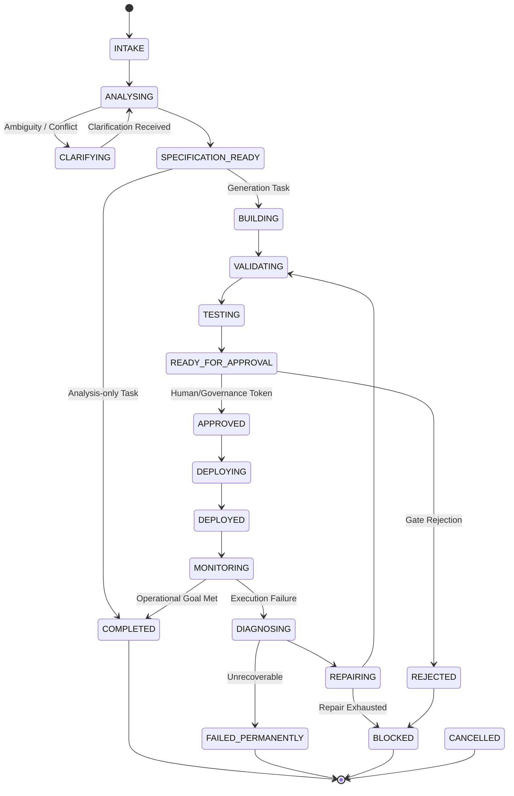

# AI Automation Engineer (AAE)

**AI Automation Engineer (AAE)** is an enterprise-grade autonomous engineering agent platform designed to intake unstructured automation requests, synthesize formal specifications, build production-ready n8n workflows, enforce zero-trust human governance approval, manage deployments, triage runtime execution failures, and autonomously apply self-healing repairs.

---

## Key Capabilities

- **Pure Domain Core & 21-State Lifecycle:** Zero-dependency business domain model governing the entire lifecycle through 17 active states and 4 terminal states with strict transition enforcement.
- **Specification Synthesis:** Deconstructs raw user requests into atomic requirement items with confidence and risk classifications, flags ambiguities and conflicts, and versions immutable specifications.
- **n8n Orchestration Provider:** Validates node configurations, parameters, and expressions against provider capabilities; generates compliant n8n workflow definitions.
- **Zero-Trust Governance Gates:** Cryptographically verifiable, single-use approval tokens binding target version and environment. Atomic single-winner consumption eliminates race conditions and replay attacks.
- **Durable Relational Persistence:** PostgreSQL 16 persistence engine with Alembic migrations, explicit bidirectional data mappers, Unit of Work transaction coordination, and pessimistic row locking for concurrency safety.
- **Observability & Audit Trail:** Tamper-evident, append-only audit trail with automatic recursive redaction of sensitive credentials, tokens, and secrets.
- **Automated Triage & Self-Healing:** Captures runtime failures, performs automated root-cause diagnostics, and orchestrates atomic repair attempts.

---

## Architecture Overview

```text
       +---------------------------------------------------------+
       |                       Application                       |
       |     (API Endpoints, CLI, FastMCP Tools, Unit of Work)   |
       +----------------------------+----------------------------+
                                    |
                                    v
       +----------------------------+----------------------------+
       |   Persistence Adapters     |    Workflow Providers      |
       | (SQLAlchemy, Repositories, | (n8n API Client, Webhook   |
       |   Mappers, Migrations)     |   Triggers, Node Catalog)  |
       +----------------------------+----------------------------+
                                    |
                                    v
       +---------------------------------------------------------+
       |                    Pure Domain Layer                    |
       |   * 21-State Machine Engine    * State Validation       |
       |   * Requirement Aggregates     * Immutable Versions     |
       |   * Single-Use Approval Gates  * Execution & Diagnosis  |
       |   (ZERO external dependencies, ZERO database awareness) |
       +---------------------------------------------------------+
```

---

## 21-State Agent Lifecycle



---

## Project Structure

```text
AAE/
|-- app/
|   |-- api/                   # FastMCP and REST API route definitions
|   |-- config/                # Environment settings & secret redaction
|   |-- db/                    # Persistence layer
|   |   |-- mappers/           # Bidirectional Domain <-> ORM mappers
|   |   |-- migrations/        # Alembic schema versions
|   |   |-- models/            # SQLAlchemy ORM database models
|   |   |-- repositories/      # Repository implementations & Unit of Work
|   |   `-- session.py         # Engine & connection pool configuration
|   |-- domain/                # Pure business logic (Zero external dependencies)
|   |   |-- models/            # Domain aggregates, entities, and value objects
|   |   |-- errors.py          # Domain-specific typed exceptions
|   |   `-- state_machine.py   # 21-state transition matrix & validator
|   |-- logging/               # Structured JSON logging & secret scrubbing
|   |-- provider/              # n8n client, schemas, and node capability registry
|   `-- security/              # Secret masking, token validation, and security policies
|-- docs/                      # Comprehensive architectural and operational documentation
|   |-- architecture/          # Architecture blueprints and persistence schema
|   |-- decisions/             # Architecture Decision Records (ADRs)
|   `-- operations/            # Verification reports and audit gates
|-- tests/
|   |-- api/                   # Health and API integration tests
|   |-- integration/           # Live database migrations, concurrency & n8n tests
|   |-- provider/              # n8n client contract tests
|   |-- security/              # Secret redaction & security baseline tests
|   `-- unit/                  # Domain model, state machine, and repository unit tests
|-- docker-compose.yml         # Local development services (PostgreSQL 16, n8n)
|-- pyproject.toml             # Python package dependencies & tool settings
`-- alembic.ini                # Alembic migration configuration
```

---

## Getting Started

### Prerequisites

- Python 3.11+ (Python 3.14 compatible)
- Docker Desktop with Docker Compose
- PostgreSQL 16

### Environment Setup

1. Clone the repository:
   ```bash
   git clone https://github.com/Teleiosite/AI-Automation-Engineer-AAE-.git
   cd AI-Automation-Engineer-AAE-
   ```

2. Create a virtual environment and install dependencies:
   ```bash
   python -m venv .venv
   # Windows:
   .\.venv\Scripts\Activate.ps1
   # Linux/macOS:
   source .venv/bin/activate

   pip install -e ".[dev]"
   ```

3. Configure environment variables:
   ```bash
   cp .env.example .env
   ```

4. Start development services:
   ```bash
   docker compose up -d postgres
   ```

5. Run database migrations:
   ```bash
   alembic upgrade head
   ```

---

## Running Verification & Tests

Execute the complete test suite (91/91 tests):

```bash
pytest -v
```

### Test Suite Breakdown

- **Phase 1 Domain & Lifecycle:** 71 tests validating the 21-state transitions, boundary isolation, and domain invariants.
- **Phase 2 Relational Persistence:** 20 tests validating PostgreSQL migrations, mapper roundtrips, atomic approval races, immutability constraints, and version concurrency controls.

---

## License

This project is licensed under the terms of the [MIT License](LICENSE).
