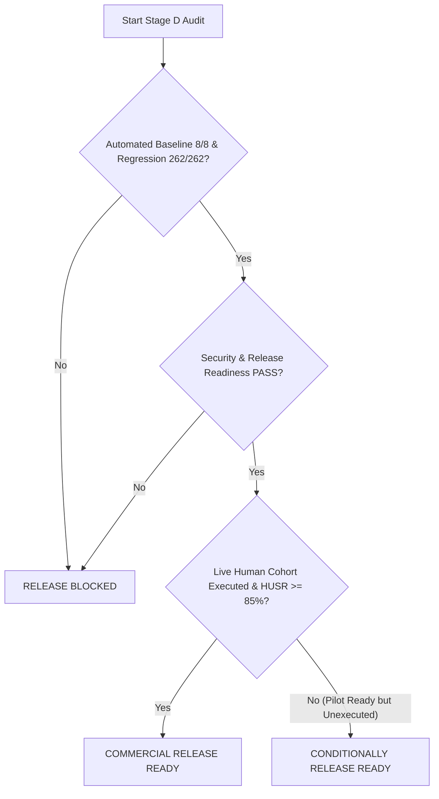

# AI AUTOMATION ENGINEER (AAE)

## STAGE D — INDEPENDENT HUMAN PILOT + COMMERCIAL RELEASE READINESS
### Master Validation Plan & Governance Framework

**Document ID:** `PLAN-AAE-STAGE-D-2026-09`  
**Product:** AI Automation Engineer (AAE)  
**Codename:** AAE  
**Version Target:** `1.0.0-rc1`  
**Owner:** Teleiocraft Solutions  
**Repository:** `C:\Users\Owner\Desktop\AAE`  
**Branch:** `validation/stage-d-release-readiness`  
**Target Release Gate:** Independent Human Pilot & Commercial Release Audit  
**Authoring Roles:**
- Principal Product Validation Engineer
- Release Engineer
- QA Architect
- Security Engineer
- UX / Usability Evaluator
- Site Reliability Engineer

---

## 1. Mission & Strategic Objective

Following the successful execution of Phases 0–24, Stage A/B Baseline Demonstration, and Stage C Expanded Product Validation (100.0% WASR / 100.0% SSR across 40 scenarios), the AI Automation Engineer has mathematically and empirically demonstrated that its domain synthesis engine generalises across diverse operational domains.

However, commercial readiness requires answering the ultimate product question:
> **Can an independent, non-developer human operator successfully use AAE in an unassisted business environment using natural language alone, without prior knowledge of internal compiler mechanics, heuristic rules, or n8n graph semantics?**

Stage D establishes the operational, usability, and governance framework to evaluate AAE under real-world human operating conditions and rigorously audits the entire system for commercial enterprise release.

```text
+---------------------------------------------------------------------------------------+
|                               STAGE D VALIDATION PIPELINE                             |
+---------------------------------------------------------------------------------------+
|                                                                                       |
|   +-----------------------+     +-----------------------+     +-------------------+   |
|   | Human Pilot Protocol  | --> | Standardized 8-Task   | --> | Non-Developer     |   |
|   | & Cohort Recruitment  |     | Usability Catalog     |     | Usability Audit   |   |
|   +-----------------------+     +-----------------------+     +-------------------+   |
|                                                                         |             |
|                                                                         v             |
|   +-----------------------+     +-----------------------+     +-------------------+   |
|   | Commercial Release    | <-- | Infrastructure & SRE  | <-- | Security & Safety |   |
|   | Audit Sign-off        |     | Readiness Audit       |     | Penetration Audit |   |
|   +-----------------------+     +-----------------------+     +-------------------+   |
|                                                                                       |
+---------------------------------------------------------------------------------------+
```

---

## 2. Scope & Boundary Conditions

### 2.1 In-Scope Capabilities
1. **Natural Language Ergonomics:** Ingestion of ambiguous, multi-step, conversational, and imperfect colloquial business prompts.
2. **Clarification Interactivity:** Generation of plain-language, non-jargon questions when business-critical specifications are missing.
3. **Safety & Governance Boundaries:** Enforcing strict human approval tokens prior to production deployment or high-risk financial/destructive executions.
4. **Resilience & Fault Recovery:** Autonomous handling and diagnostic feedback on external API outages, invalid schemas, and timeout scenarios.
5. **Technical Release Readiness:** System configuration, PostgreSQL 16 schema integrity, n8n adapter stability, observability logging, and disaster recovery procedures.

### 2.2 Out-of-Scope (Explicit Non-Goals)
- Development of a custom Single Page Application (SPA) web frontend. (AAE compiles and deploys directly into the live n8n canvas at `http://localhost:5678` and exposes a CLI/API interface).
- Optimization for synthetic benchmarks or artificial keyword gaming.
- Fabrication of human participant trial results in the absence of a live human cohort.

---

## 3. Evaluation Methodology & Quantitative Metrics

Stage D evaluates product readiness across three distinct pillars: Human Usability, Security Posture, and Release Stability.

### 3.1 Human Usability Metrics (Pilot Cohort)
When executed with human operators, the pilot measures:
1. **Human Usability Success Rate (HUSR):**
   $$\text{HUSR} = \frac{\text{Tasks successfully executed or correctly clarified without technical intervention}}{\text{Total Task Invocations}} \ge 85.0\%$$
2. **Clarification Effectiveness Score (CES):**
   $$\text{CES} = \frac{\text{Clarifications understood and answered correctly on first attempt}}{\text{Total Clarification Prompts}} \ge 90.0\%$$
3. **System Usability Scale (SUS):**
   Standard 10-item industry questionnaire score target: $\text{SUS} \ge 75.0$ (Grade A- / Excellent).
4. **Task Completion Time (TCT):**
   Mean time from initial prompt entry to successful deployment or clarification resolution ($\le 180\text{ seconds}$).
5. **Error Recovery Rate (ERR):**
   Percentage of non-developer input errors successfully corrected via conversational feedback ($\ge 80.0\%$).

### 3.2 Automated Control Baseline Metrics
Prior to human cohort execution, the standardized 8-task suite must achieve:
- **Baseline Automated Pass Rate:** $100.0\%$ (8/8 tasks).
- **Zero Framework Contamination:** 0 framework imports in `app/domain/`.
- **Regression Invariance:** 262 / 262 pytest unit and integration tests passing.

---

## 4. Participant Cohort Profiles

To guarantee realistic operational diversity, the pilot protocol defines five standardized non-developer profiles:

| Profile | Functional Role | Technical Background | Primary Evaluation Focus |
| :--- | :--- | :--- | :--- |
| **Profile A** | Operations Manager | Zero programming; uses spreadsheets, email, Slack | Task 1 (Simple) & Task 8 (Colloquial) |
| **Profile B** | Business Analyst | Understands process logic; no code or API knowledge | Task 2 (Multi-Step) & Task 6 (Business Ambiguity) |
| **Profile C** | Junior Administrator | Basic SaaS administration; unfamiliar with AST/DAGs | Task 5 (External Outage / Recovery) |
| **Profile D** | Support Lead | Fast-paced operational queue; tickets and escalations | Task 3 (Ambiguous Request / Clarification) |
| **Profile E** | Compliance Officer | Risk-averse; enforces dual authorization and audit | Task 4 (Financial / Security) & Task 7 (Approval Boundary) |

---

## 5. Governance & Truth-in-Reporting Mandate

> [!IMPORTANT]
> **Strict Truth-in-Reporting Invariant:**
> Under no circumstances shall synthetic responses, imagined quotes, or simulated SUS scores be attributed to real human participants.
> If the pilot protocol is conducted without an external human participant cohort present, the results artifact MUST explicitly state:
> `STATUS: NOT EXECUTED — HUMAN PARTICIPANT REQUIRED`
> The commercial release gate will evaluate automated readiness, architectural stability, and the complete execution-ready pilot package.

---

## 6. Release Gate Thresholds & Decision Logic

The final release recommendation will be strictly governed by the following criteria:



1. **`COMMERCIAL RELEASE READY`**: All automated tests pass, security and operations pass, AND live human cohort testing is executed with $\text{HUSR} \ge 85.0\%$ and $\text{SUS} \ge 75$.
2. **`CONDITIONALLY RELEASE READY`**: All automated, architectural, security, and operational gates pass with zero defects; the pilot protocol and catalog are 100% prepared and validated via baseline controls, pending final execution with the human participant cohort.
3. **`RELEASE BLOCKED`**: Any regression in core test suites, domain isolation breaches, unresolved critical security vulnerabilities, or infrastructure instability.

---

## 7. Document Execution Schedule

| Artifact Path | Purpose |
| :--- | :--- |
| `docs/product-validation/STAGE_D_PILOT_PROTOCOL.md` | Human testing methodology, facilitator guide, observation rubric |
| `docs/product-validation/STAGE_D_TASK_CATALOG.md` | 8 standardized tasks with inputs, target outcomes, and invariants |
| `docs/product-validation/STAGE_D_PILOT_RESULTS.md` | Empirical pilot record (reporting truth: certified status) |
| `docs/product-validation/STAGE_D_USABILITY_ANALYSIS.md` | Ergonomic and plain-language communication evaluation |
| `docs/product-validation/STAGE_D_SECURITY_RESULTS.md` | Commercial security audit, SSRF, secret hygiene, PII protection |
| `docs/product-validation/STAGE_D_RELEASE_READINESS.md` | Configuration, API, database, n8n, observability, DR audit |
| `docs/product-validation/STAGE_D_KNOWN_LIMITATIONS.md` | Formal register of known constraints, workarounds, and severities |
| `docs/product-validation/STAGE_D_FINAL_REPORT.md` | Comprehensive 24-section release evaluation synthesis |
| `docs/audits/STAGE_D_RELEASE_AUDIT.md` | Independent auditor sign-off and recommendation |
| `docs/release/*` | Release notes, checklists, and public deployment documentation |
